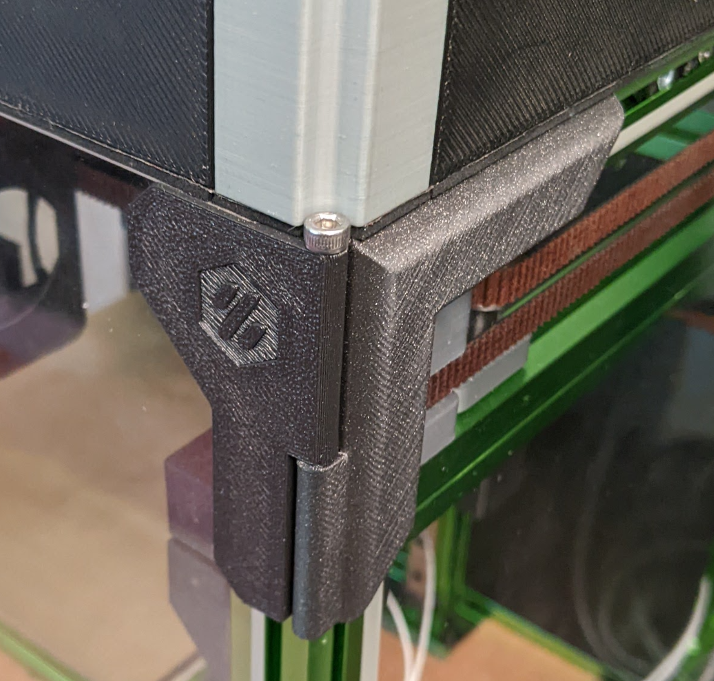
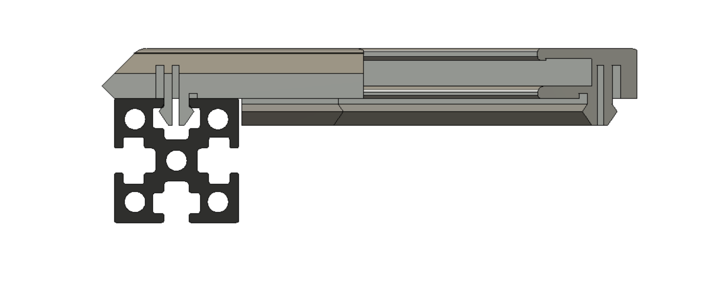
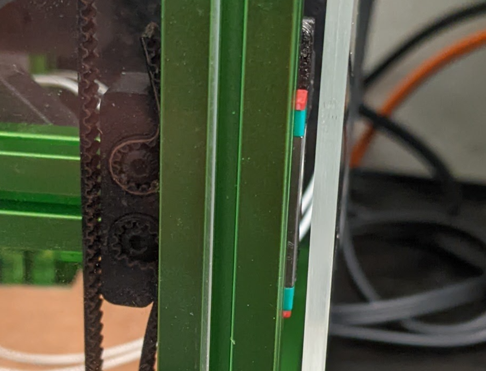
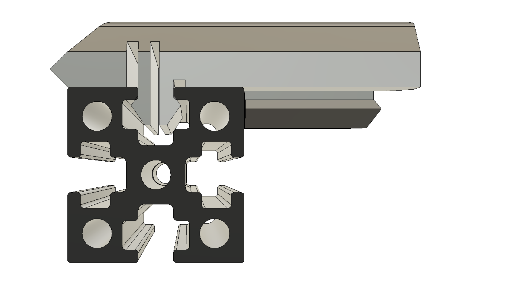
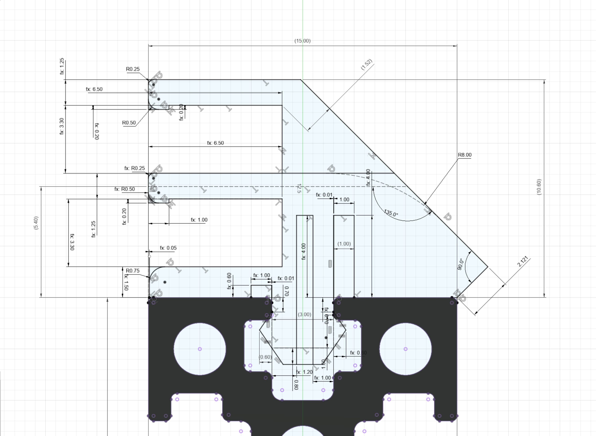
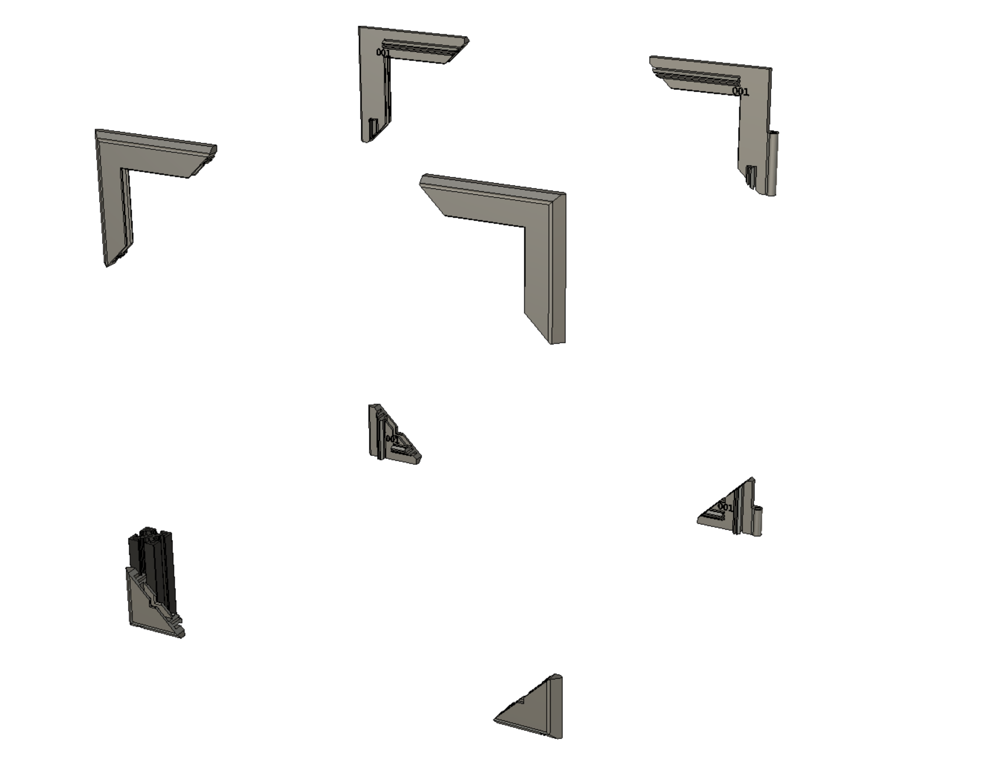

# ZeroPanels - mind the gap, with a snap
Made with :heart: by Zruncho, with insights from 10+ beta testers

**ZeroPanels**: an enclosure design which uses screw-less, nut-less, magnet-less, zero-infill, 3d-printed clips.

## Updates
* 2022-01-23 Public release!

## Why ZeroPanels?

ZeroPanels are a faster and easier way to enclose your Zero-size printer with 15mm-wide extrusions - whether [Voron Zero](https://vorondesign.com/voron0.1), [F-Zero](https://github.com/zruncho3d/f-zero), [Tri-Zero](https://github.com/zruncho3d/tri-zero), [Double Dragon (X0)](https://github.com/zruncho3d/double-dragon), [Micron](https://github.com/hartk1213/Micron), [Salad Fork](https://github.com/Yeriwyn/Salad_Fork), [Crucible](https://github.com/Maverick-3D/Crucible), or other.

Quick to remove: **5 seconds** beats **5 minutes**.  

Fast to print: a full plate prints in well under two hours.

Designed to click in the first time, then support many insertion & removal cycles.

They solve one pain point of V0-style enclosure clips: *24 !@#$ing screws and nuts*.  Even with [NoDropNuts](https://github.com/zruncho3d/f-zero/tree/main/STLs/NoDropNuts) to keep the nuts in place, it's still 24 !@#$ing screws.  These get to be a pain, especially if you like to tinker.  

They also solve a problem that many [Printers for Ants](www.3dprintersforants.com) have: getting an extra mm to clear an MGN7 carriage (17mm wide) when mounted in a 1515 extrusion (15mm wide).  You can solve this problem by printing thicker clips and using foam tape, but if you’re going to reprint enclosure parts… you might as well avoid the pain of all those screws too.

**ZeroPanels solve both of these problems.**

This is the gap to mind, being... minded:

There’s more thought and work in these little parts than you might realize.  

The design goals were to:
* Print quickly, with a minimum of material (zero-infill design with a single perimeter)
* Minimize the need for any additional tape or fasteners
* Support slightly-off panels and slightly-off frames

The inspiration came from car interior panels, which use a sequence of clips to hold in place securely, without screws.  Early versions used vertically-printed tight-in-the-extrusion clips with panels that would slide into place.  But this has practical issues, like getting the panel out, and ensuring that it seals.

The insight that made this practical was realizing that "picture-frame corners" would enable printing at a 45 degree angle, with potentially just one unique part, and could clip to the entire panel, then into the frame.

Beyond here, the details were in getting the flexible clips to fit right and flex right, as well as understanding where the variation in extrusions even *is*.  Fitting to one extrusion type was not too bad, but fitting to two required major changes.

Zruncho printed over 20 prints to get this even *close* to right.  

The corps of beta testers (thank you! see Credits below) then helped identify a number of reliability and printability improvements, resulting in a public release.

It won't fit *every* extrusion, but the default 015 size should work: "one size fits most".  As this gets deployed more broadly, we'll learn what the corner cases are.

## Quickstart
* Choose a plate from STLs/Plates/: pick the 015-size plate that matches your printer type:
  * *V0-style*: fits printers with front top idlers, like [Voron Zero](https://vorondesign.com/voron0.1), [Tri-Zero](https://github.com/zruncho3d/tri-zero), or [Double Dragon / X0](https://github.com/zruncho3d/double-dragon)
  * *General-style*: fits others, like [Micron](https://github.com/hartk1213/Micron), [Salad Fork](https://github.com/Yeriwyn/Salad_Fork), [Crucible](https://github.com/Maverick-3D/Crucible), [F-Zero](https://github.com/zruncho3d/f-zero) (see *F0 note* below) or other.
* Print in ABS with one perimeter and no infill.
* Assemble the left-side panel.  Clear any nuts out of the way first, then align the pointy bits into the extrusions, pushing in one clip in at a time. If the panel fully inserts and holds, great!  If not, you may be better served with a different size; see Full Instructions below.
* Remove the panel, by popping off individual clips, one-at-a-time.
* Pop off the panel and add 3mm or [1/8” adhesive-backed foam tape](https://www.amazon.com/dp/B09L4MYQ83).  Cut at 45 degrees, get the length right, cut the other side at 45 degrees, and attach the strip to the panel, for each side
* Repeat for the hinge side, making sure to drill out the hinge holes to just-slightly-under-3mm first, before threading in the hinge screws.

Enjoy!

## Full Instructions

### Picking the optimal size

The 3 sizes are default [015], tight [025], and loose [001].

The numbers represent the amount of "extra grip" - beyond 3mm - for the slot inside 1515 extrusions, for each side.

This view shows the 001 size on a 3mm-slot-width extrusion: almost an exact fit, with no "extra grip".

**The default 015 size should work for almost everyone**.  

You could look up manufacturer specs to inform the ideal size choice, but ideally, you'd measure using calipers first, because **1515 extrusions vary a surprising amount**.

Zruncho has seen datasheets indicate 3.4mm width, but then measured 3.15mm.  Beta testers measured values between 2.90mm and 3.75mm **(!!!)**.

Ideally, measure at multiple points on multiple extrusions, then use this sizing chart:

| Measured Size Range | Recommendation |
| - | - |
| below 3.2mm | loose: 001 |
| between 3.2mm and 3.5mm | default: 015 |
| above 3.5mm | tight: 025 |

Since this is a fast print, you can try a test part (or a few test parts) first, from each size!  Numbers are debossed into each part to tell them apart easily.

See if the amount of snap feels right, and whether the part can move once inserted, and whether it removes with an amount of force that works for you.

### Printing Tips

For ease of printing, use the provided plates.

The sample parts below show KVP Stellar Black ABS, printed at 235C on an [F-Zero](https://github.com/zruncho3d/f-zero), at 100 mm/s.

Use these recommended print settings:
* **Slicing/Infill**
  * 0% infill
  * 0.7mm extrusion width
  * 1 perimeter: use 2+ if you want for less flex… but once installed you’ll probably never care
  * 0 top layers, 3 bottom layers
  * 0.2mm slicing thickness; up to 0.3mm works fine with a 0.4mm nozzle, as the wide extrusion width helps with overhangs and thicker → faster printing
* **Speed**: whatever prints well for you! Large extrusion widths will create backpressure and change the optimal pressure advance value, and going slower may help reduce the chance of problems.
* **Brim**: not necessary, but it may help adhesion
* **Temp**: Normal-to-hotter is better here for adhesion
* **Orientation**: Orient on the 45, as in the STLs; rotate so that the seam is in back for aesthetics, but also to make sure the seam doesn’t affect any critical dimensions.   
* **Material**: ABS is highly recommended and is the only material tested, because it provides a nice snap.   PETG is probably fine, but more brittle materials like PLA are an unknown.   If you try it, share the results.
* **Slicer**: SuperSlicer is known to work well here, but there should be nothing slicer-specific here.

Using a bed with good adhesion (PEI), a hint of first-layer smush (not too much though: no bed chamfer here, intentionally), and reasonable cooling, you should be able to print these parts successfully.  

If not...

### Troubleshooting Tips

**Cooling a problem?**  Print the full plate or space out the parts on the plate.

**Adhesion a problem?**  Add a brim, add more first-layer smush, or use a bed adhesive.

**Strength a problem (breaking at layer lines)?**  Reduce cooling or jack up the temp.

## CAD Notes

The F360 file is parameterized to enable easy dimension adjustments where it matters.  See the descriptions in the F360 file.

If you want to make any changes and then export a custom clip set, it’s not too bad.  

To clear out the V0-specific bits:
* Delete the V0-specific features in the CAD: there are 4 of these.  
* Fix any profiles that Fusion loses, like the hinges, as well as any body names that change when the bodies change.  

For most changes, make sure to update the debossed text for any size changes. Then do the 3D-Print .stl export for the first 6 bodies, which should include two duplicated ones.

Before release, Zruncho's process is to import the STL, spread the parts, reorient along the 45 degree edge, turn them to hide the seam as needed, re-spread, manually move to enable overlap if motivated, and then export the plate as STL.

### Using the profile in other parts
Feel free to use the geometry!  It’s been heavily tested and evolved for a good cycle life, good snap, and fits many extrusion types with a small number of variants. The key parameters are mostly explained in CAD, too.

This would be a useful profile for things like Wago mounts, wire clips, LED bars, and more.

## F0 Note
The General files don’t quite fit F0s, which use a custom corner design.  The easiest path here is to print those, then use flush cutters to trim them slightly.

## Improvement Ideas
Some ideas:
* Optional screw locks, especially for the V0 top parts.  Could be through-hole in these parts, to match screws with added-in-post heatsets on the front idlers.   Or, could use self-tapping screws with wedge-shaped clip parts to expand a taper and lock things in more securely.  

## FAQ

### What's the catch?

Because the clips enable the panels to float, the panels provide no rigidity benefit to the frame, just like [curtain walls](https://en.wikipedia.org/wiki/Curtain_wall_(architecture)) on modern skyscrapers.

However, because these panels aren't positively coupled to the frame, they may reduce noise, to make it less likely that they act as a speaker to amplify resonances.

We'll see about that one.

Another possible catch is that not every printer is dimensionally accurate, and that can affect how well the design works *for you*.  They're designed to account for variance in panel width, extrusion slot width, and panel thickness.  But if your printer prints bulges at the corners, for example, the clips may not work for you.

### Are there mid-position clips (between the frame corners)?  Not yet.
Mid-position clips, like the default V0 enclosure, would be an easy addition, though.

### Could I extend the design to fully cover extrusions?  Yes.
Yes, you could!  That was the original design, and how the CAD works, intentionally.  

You'd have to think through the print orientation(s) though to fully reuse this profile.

### Can I do a double-panel version?  Yes.
Yes, the CAD includes this in the main profile sketch, for a DoomCube-inspired double-pane version.  Take a look.

### Can I do a “Regular V0” version with no 2mm offset to the panels?  Yes.
Yes, you can.  Not in the geometry yet, though.  Can hack it with a few dimension changes though.

## Credits

These parts are a spinoff from the [Tri-Zero](https://github.com/zruncho3d/tri-zero) project.

Thanks to Yeri, Speedy, Ericsson, RogueNeurons, Maverick, Sparkss, rok3, flyespresso, tecnologic, and Lowstream on the [DoomCube Discord](https://discord.gg/doomcube) for extrusion measurements.

Thanks to Ericsson, RogueNeurons, Maverick, Yeri, rok3, flyespresso, StoicHollow, Lowstream, and Tigran on the [DoomCube Discord](https://discord.gg/doomcube) for sharing test-print feedback!

